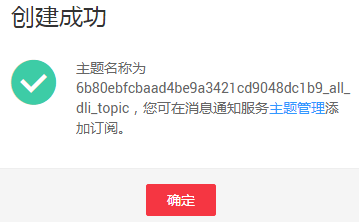
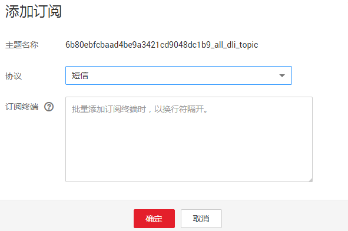

# Spark作业管理

## 操作场景

Spark作业为在Spark作业编辑窗口中提交的作业。

## 作业列表

作业列表显示所有的Spark作业，作业数量较多时，系统分页显示，您可以查看任何状态下的作业。

> **说明：**   
>作业执行成功后，作业记录只保存6小时。  

**表 1**  作业列表参数

<table><thead align="left"><tr id="zh-cn_topic_0122090417_row2555468715120"><th class="cellrowborder" valign="top" width="16.07%" id="mcps1.2.3.1.1">
参数

</th>
<th class="cellrowborder" valign="top" width="83.93%" id="mcps1.2.3.1.2">
参数说明

</th>
</tr>
</thead>
<tbody><tr id="zh-cn_topic_0122090417_row46758327132"><td class="cellrowborder" valign="top" width="16.07%" headers="mcps1.2.3.1.1 ">
作业ID

</td>
<td class="cellrowborder" valign="top" width="83.93%" headers="mcps1.2.3.1.2 ">
所提交Spark作业的ID，由系统默认生成。

</td>
</tr>
<tr id="zh-cn_topic_0122090417_row32873162171713"><td class="cellrowborder" valign="top" width="16.07%" headers="mcps1.2.3.1.1 ">
作业名称

</td>
<td class="cellrowborder" valign="top" width="83.93%" headers="mcps1.2.3.1.2 ">
所提交Spark作业的名称。

</td>
</tr>
<tr id="zh-cn_topic_0122090417_row31011923151038"><td class="cellrowborder" valign="top" width="16.07%" headers="mcps1.2.3.1.1 ">
作业状态

</td>
<td class="cellrowborder" valign="top" width="83.93%" headers="mcps1.2.3.1.2 ">
作业的状态信息，包括如下。

<ul id="zh-cn_topic_0122090417_ul32930526154023"><li>启动中：正在启动</li><li>运行中：正在执行任务</li><li>已失败：session已退出</li><li>已成功：session运行成功</li><li>恢复中：正在恢复任务</li></ul>
</td>
</tr>
<tr id="zh-cn_topic_0122090417_row36301606171658"><td class="cellrowborder" valign="top" width="16.07%" headers="mcps1.2.3.1.1 ">
所属队列

</td>
<td class="cellrowborder" valign="top" width="83.93%" headers="mcps1.2.3.1.2 ">
所提交Spark作业所在的队列。

</td>
</tr>
<tr id="zh-cn_topic_0122090417_row6424839516213"><td class="cellrowborder" valign="top" width="16.07%" headers="mcps1.2.3.1.1 ">
创建时间

</td>
<td class="cellrowborder" valign="top" width="83.93%" headers="mcps1.2.3.1.2 ">
每个作业的创建时间，可按创建时间顺序或倒序显示作业列表。

</td>
</tr>
<tr id="row1536633125019"><td class="cellrowborder" valign="top" width="16.07%" headers="mcps1.2.3.1.1 ">
最后修改时间

</td>
<td class="cellrowborder" valign="top" width="83.93%" headers="mcps1.2.3.1.2 ">
作业运行完成的时间。

</td>
</tr>
<tr id="zh-cn_topic_0122090417_row1662880815250"><td class="cellrowborder" valign="top" width="16.07%" headers="mcps1.2.3.1.1 ">
操作

</td>
<td class="cellrowborder" valign="top" width="83.93%" headers="mcps1.2.3.1.2 "><ul id="zh-cn_topic_0122090417_ul181927155164"><li>删除：删除当前作业。</li><li>日志详情<ul id="zh-cn_topic_0122090417_ul94511619309"><li>当作业状态在“运行中”，“日志类型”显示“提交日志”。</li><li>当作业状态在“已成功”或“已失败”，“日志类型”显示“提交日志”和“运行日志”。</li></ul>
</li><li>重新执行：重新执行当前作业。</li><li>Spark UI：单击后，将跳转至Spark任务运行情况界面。</li></ul>
</td>
</tr>
</tbody>
</table>

## 查找作业

1.  在DLI管理控制台的顶部菜单栏中，选择“作业管理“。
2.  在“作业管理“页面，选择“状态”和“所属队列”。

    系统将根据设置的过滤条件，在作业列表显示符合对应条件的作业。

    **图 1**  查找Spark作业结果  
    

## 查看作业详情

在“作业管理“页面，选中一条作业，单击该作业ID左侧的或在“操作”列中单击“日志详情”，可查看该条作业的相关日志。

## 终止作业

在“作业管理“页面，单击“操作”列的“删除“，删除作业。

## 创建消息通知主题

确定创建消息通知主题后，您可在消息通知服务的“主题管理”页面中，对对应的主题“添加订阅”，选择不同方式（例如短信或者邮件等）进行订阅；订阅成功后，若作业失败，则系统将会自动发送消息到您指定的订阅终端。具体操作如下：

1.  在Spark作业管理页面，单击，弹出[图2](#fig969753431112)所示对话框。

    **图 2**  创建消息通知主题  
    

2.  单击“确定”。弹出[图3](#fig12471323125315)所示对话框。

    **图 3**  创建主题成功  
    

3.  单击[图3](#fig12471323125315)中“主题管理”，跳转至消息通知服务“主题管理”页面。

    **图 4**  主题管理  
    

4.  在[图4](#fig361113238574)对应主题的“操作”栏中，单击“添加订阅”，即可在[图5](#fig075918101718)对话框中，选择“协议”，确定订阅方式。

    **图 5**  添加订阅  
    

5.  返回[图3](#fig12471323125315)所在页面，单击“确定”，完成创建消息通知主题。

