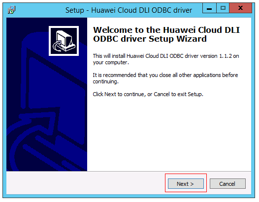
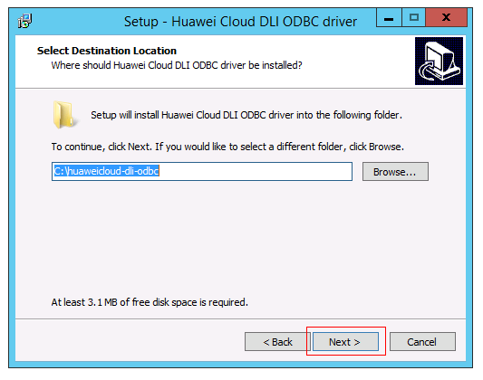
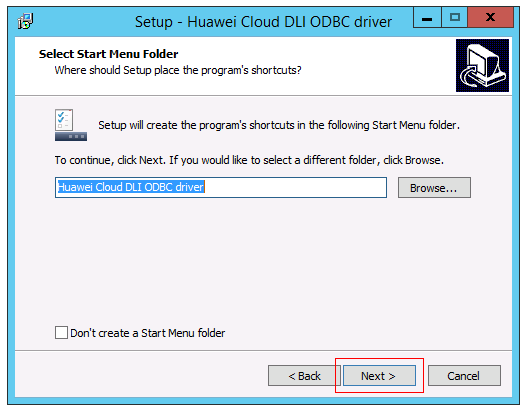
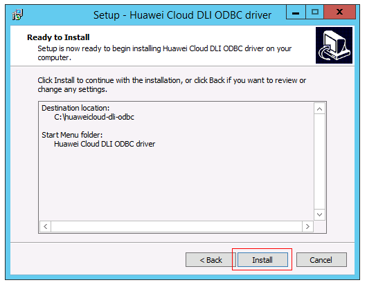
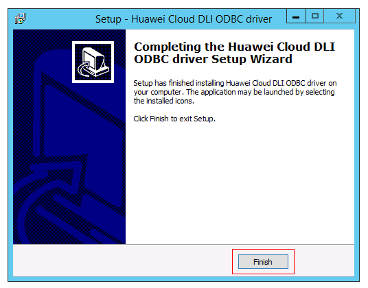
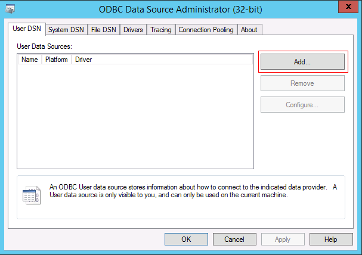
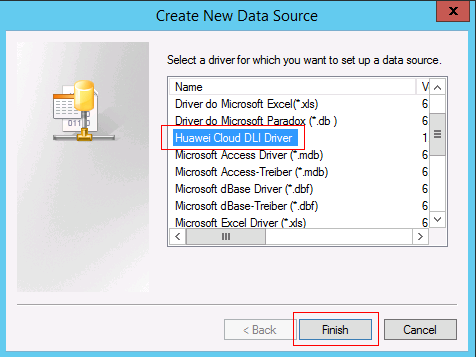
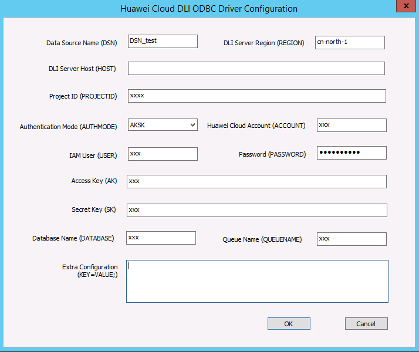
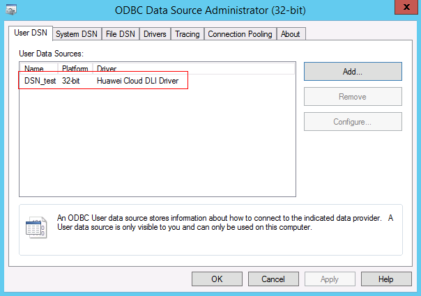

# 使用ODBC提交作业<a name="dli_01_0265"></a>

## 操作场景<a name="section183810247200"></a>

在Windows环境下您可以使用ODBC应用程序连接DLI服务端提交作业。

## 前提条件<a name="section12655972162948"></a>

仅支持Windows 2012及以上版本操作系统。

## 操作步骤<a name="section2946158316655"></a>

1.  解压安装包。

    将“huaweicloud-dli-odbc-<version\>.zip”解压到系统任意目录下。

2.  安装ODBC驱动。
    1.  双击执行解压目录下的“huaweicloud-dli-odbc-<version\>-setup.exe”文件。
    2.  点击“Next”按钮安装ODBC驱动。

        **图 1**  ODBC驱动安装导航<a name="fig855210451504"></a>  
        

        1.  选择安装目录，默认安装路径为“C:\\huaweicloud-dli-odbc”。完成选择后，点击“Next”继续安装。

            **图 2**  选择安装目录<a name="fig562222624017"></a>  
            

            > **说明：**   
            >建议使用默认安装路径，如果修改为其他安装路径，需要手动修改日志配置文件。  

        2.  选择开始菜单目录，完成选择后，点击“Next”继续安装。

            **图 3**  选择开始菜单目录<a name="fig86222269400"></a>  
            

        3.  确认安装目录和开始菜单路径后，点击“Install”安装ODBC驱动。

            **图 4**  确认安装目录和开始菜单路径<a name="fig155927819313"></a>  
            

        4.  点击“Finish”完成ODBC驱动安装。

            **图 5**  完成安装<a name="fig154495222318"></a>  
            


3.  配置日志参数（可选）。

    > **说明：**   
    >当ODBC驱动安装目录不是“C:\\huaweicloud-dli-odbc”时，需要执行该步骤。  

    1.  打开驱动安装目录下的log.properties文件，例如：“C:\\xxx\\windows\\log.properties”。
    2.  修改日志输出路径，例如：“log4cplus.appender.DLILog.File=C:\\xxx\\windows\\log\\dli\_odbc.log”。

        > **说明：**   
        >日志输出路径建议为安装路径下log目录，根据实际安装路径配置。  


4.  <a name="li65930874174932"></a>配置数据源。
    1.  进入Windows控制面板中的管理工具，双击“ODBC Data Sources \(32-bit\)”启动32位ODBC数据源管理器。

        > **说明：**   
        >32位的ODBC数据源管理器也可以通过下面程序启动：  
        >-   64位Windows系统请使用：C:\\Windows\\SysWOW64\\odbcad32.exe  
        >-   32位Windows系统请使用：C:\\Windows\\System32\\odbcad32.exe  

    2.  添加数据源。

        添加用户数据源使用“User DSN”标签，添加系统数据源使用“System DSN”标签。点击“Add”按钮添加数据源。

        **图 6**  ODBC数据源管理器<a name="fig105312347510"></a>  
        

    3.  选择“Huawei Cloud DLI Driver”，点击“Finish”按钮。

        **图 7**  创建新的数据源<a name="fig101611171665"></a>  
        

    4.  填写ODBC驱动配置参数，点击“OK”完成数据源配置。ODBC驱动配置参数参考[表1](#table571552873114)。

        **图 8**  DLI ODBC驱动配置<a name="fig947520261615"></a>  
        

        > **说明：**   
        >-   除DSN外，其他参数均可在应用程序中通过ODBC连接参数配置。对于同一个参数，当ODBC连接参数与数据源同时配置时，ODBC驱动优先使用应用程序连接参数中的配置参数。  
        >-   当有多个Extra Configuration时，配置方式为：KEY1=VALUE1;KEY2=VALUE2  

        **表 1**  DLI ODBC驱动配置参数

        <a name="table571552873114"></a>
        <table><thead align="left"><tr id="row10713182823115"><th class="cellrowborder" valign="top" width="16.93%" id="mcps1.2.5.1.1"><p id="p27119155155349"><a name="p27119155155349"></a><a name="p27119155155349"></a>属性项</p>
        </th>
        <th class="cellrowborder" valign="top" width="10.81%" id="mcps1.2.5.1.2"><p id="p49167942155349"><a name="p49167942155349"></a><a name="p49167942155349"></a>必须配置</p>
        </th>
        <th class="cellrowborder" valign="top" width="10.66%" id="mcps1.2.5.1.3"><p id="p23180374155349"><a name="p23180374155349"></a><a name="p23180374155349"></a>默认值</p>
        </th>
        <th class="cellrowborder" valign="top" width="61.6%" id="mcps1.2.5.1.4"><p id="p65670986155349"><a name="p65670986155349"></a><a name="p65670986155349"></a>描述</p>
        </th>
        </tr>
        </thead>
        <tbody><tr id="row27131428163110"><td class="cellrowborder" valign="top" width="16.93%" headers="mcps1.2.5.1.1 "><p id="p371342817318"><a name="p371342817318"></a><a name="p371342817318"></a>DSN</p>
        </td>
        <td class="cellrowborder" valign="top" width="10.81%" headers="mcps1.2.5.1.2 "><p id="p971342818315"><a name="p971342818315"></a><a name="p971342818315"></a>是</p>
        </td>
        <td class="cellrowborder" valign="top" width="10.66%" headers="mcps1.2.5.1.3 "><p id="p571322863114"><a name="p571322863114"></a><a name="p571322863114"></a>-</p>
        </td>
        <td class="cellrowborder" valign="top" width="61.6%" headers="mcps1.2.5.1.4 "><p id="p47131028203117"><a name="p47131028203117"></a><a name="p47131028203117"></a>ODBC数据源名称，在应用程序的链接字符串中使用该名称。</p>
        </td>
        </tr>
        <tr id="row1771562811317"><td class="cellrowborder" valign="top" width="16.93%" headers="mcps1.2.5.1.1 "><p id="p1071316281314"><a name="p1071316281314"></a><a name="p1071316281314"></a>REGION</p>
        </td>
        <td class="cellrowborder" valign="top" width="10.81%" headers="mcps1.2.5.1.2 "><p id="p107151228113118"><a name="p107151228113118"></a><a name="p107151228113118"></a>是</p>
        </td>
        <td class="cellrowborder" valign="top" width="10.66%" headers="mcps1.2.5.1.3 "><p id="p127151228103110"><a name="p127151228103110"></a><a name="p127151228103110"></a>-</p>
        </td>
        <td class="cellrowborder" valign="top" width="61.6%" headers="mcps1.2.5.1.4 "><p id="p3715152803112"><a name="p3715152803112"></a><a name="p3715152803112"></a>对接的DLI服务的Region，例如：cn-north-1。</p>
        </td>
        </tr>
        <tr id="row5715128163118"><td class="cellrowborder" valign="top" width="16.93%" headers="mcps1.2.5.1.1 "><p id="p5715132883110"><a name="p5715132883110"></a><a name="p5715132883110"></a>HOST</p>
        </td>
        <td class="cellrowborder" valign="top" width="10.81%" headers="mcps1.2.5.1.2 "><p id="p13715102811312"><a name="p13715102811312"></a><a name="p13715102811312"></a>否</p>
        </td>
        <td class="cellrowborder" valign="top" width="10.66%" headers="mcps1.2.5.1.3 "><p id="p67151281317"><a name="p67151281317"></a><a name="p67151281317"></a>-</p>
        </td>
        <td class="cellrowborder" valign="top" width="61.6%" headers="mcps1.2.5.1.4 "><p id="p1771572819316"><a name="p1771572819316"></a><a name="p1771572819316"></a>对接的DLI服务的域名。。</p>
        </td>
        </tr>
        <tr id="row4715182812316"><td class="cellrowborder" valign="top" width="16.93%" headers="mcps1.2.5.1.1 "><p id="p1715182816312"><a name="p1715182816312"></a><a name="p1715182816312"></a>PROJECTID</p>
        </td>
        <td class="cellrowborder" valign="top" width="10.81%" headers="mcps1.2.5.1.2 "><p id="p9715182863112"><a name="p9715182863112"></a><a name="p9715182863112"></a>是</p>
        </td>
        <td class="cellrowborder" valign="top" width="10.66%" headers="mcps1.2.5.1.3 "><p id="p9715528123112"><a name="p9715528123112"></a><a name="p9715528123112"></a>-</p>
        </td>
        <td class="cellrowborder" valign="top" width="61.6%" headers="mcps1.2.5.1.4 "><p id="p2715192883114"><a name="p2715192883114"></a><a name="p2715192883114"></a>用户访问的DLI服务使用的项目编号。</p>
        </td>
        </tr>
        <tr id="row12280456104419"><td class="cellrowborder" valign="top" width="16.93%" headers="mcps1.2.5.1.1 "><p id="p7281125694415"><a name="p7281125694415"></a><a name="p7281125694415"></a>AUTHMODE</p>
        </td>
        <td class="cellrowborder" valign="top" width="10.81%" headers="mcps1.2.5.1.2 "><p id="p628145604410"><a name="p628145604410"></a><a name="p628145604410"></a>是</p>
        </td>
        <td class="cellrowborder" valign="top" width="10.66%" headers="mcps1.2.5.1.3 "><p id="p6281185644413"><a name="p6281185644413"></a><a name="p6281185644413"></a>-</p>
        </td>
        <td class="cellrowborder" valign="top" width="61.6%" headers="mcps1.2.5.1.4 "><p id="p22811756124410"><a name="p22811756124410"></a><a name="p22811756124410"></a>链接DLI服务使用的认证模式，当前支持AK/SK和TOKEN两种模式，参考<a href="认证.md">认证</a>。0表示使用TOKEN模式；1表示AK/SK模式。</p>
        </td>
        </tr>
        <tr id="row596810814520"><td class="cellrowborder" valign="top" width="16.93%" headers="mcps1.2.5.1.1 "><p id="p14968589452"><a name="p14968589452"></a><a name="p14968589452"></a>ACCOUNT</p>
        </td>
        <td class="cellrowborder" valign="top" width="10.81%" headers="mcps1.2.5.1.2 "><p id="p1696910854519"><a name="p1696910854519"></a><a name="p1696910854519"></a>否</p>
        </td>
        <td class="cellrowborder" valign="top" width="10.66%" headers="mcps1.2.5.1.3 "><p id="p7969381452"><a name="p7969381452"></a><a name="p7969381452"></a>-</p>
        </td>
        <td class="cellrowborder" valign="top" width="61.6%" headers="mcps1.2.5.1.4 "><p id="p996918154519"><a name="p996918154519"></a><a name="p996918154519"></a>登录华为云的账号名称，当选择认证模式为TOKEN时需要配置。</p>
        </td>
        </tr>
        <tr id="row10516594514"><td class="cellrowborder" valign="top" width="16.93%" headers="mcps1.2.5.1.1 "><p id="p16545104517"><a name="p16545104517"></a><a name="p16545104517"></a>USER</p>
        </td>
        <td class="cellrowborder" valign="top" width="10.81%" headers="mcps1.2.5.1.2 "><p id="p2611518456"><a name="p2611518456"></a><a name="p2611518456"></a>否</p>
        </td>
        <td class="cellrowborder" valign="top" width="10.66%" headers="mcps1.2.5.1.3 "><p id="p2619534518"><a name="p2619534518"></a><a name="p2619534518"></a>-</p>
        </td>
        <td class="cellrowborder" valign="top" width="61.6%" headers="mcps1.2.5.1.4 "><p id="p158335391617"><a name="p158335391617"></a><a name="p158335391617"></a>登录华为云的IAM子用户名称，当选择认证模式为TOKEN时需要配置。</p>
        <p id="p10645104510"><a name="p10645104510"></a><a name="p10645104510"></a>采用主账号登录时，该参数配置与ACCOUNT相同，为华为云的账号名称。</p>
        </td>
        </tr>
        <tr id="row10902113121512"><td class="cellrowborder" valign="top" width="16.93%" headers="mcps1.2.5.1.1 "><p id="p1490283121517"><a name="p1490283121517"></a><a name="p1490283121517"></a>PASSWORD</p>
        </td>
        <td class="cellrowborder" valign="top" width="10.81%" headers="mcps1.2.5.1.2 "><p id="p1890210314150"><a name="p1890210314150"></a><a name="p1890210314150"></a>否</p>
        </td>
        <td class="cellrowborder" valign="top" width="10.66%" headers="mcps1.2.5.1.3 "><p id="p1190273181519"><a name="p1190273181519"></a><a name="p1190273181519"></a>-</p>
        </td>
        <td class="cellrowborder" valign="top" width="61.6%" headers="mcps1.2.5.1.4 "><p id="p0902123116150"><a name="p0902123116150"></a><a name="p0902123116150"></a>登录华为云的用户密码，当选择认证模式为TOKEN时需要配置。</p>
        </td>
        </tr>
        <tr id="row13164191711616"><td class="cellrowborder" valign="top" width="16.93%" headers="mcps1.2.5.1.1 "><p id="p716481701615"><a name="p716481701615"></a><a name="p716481701615"></a>AK</p>
        </td>
        <td class="cellrowborder" valign="top" width="10.81%" headers="mcps1.2.5.1.2 "><p id="p5164017151618"><a name="p5164017151618"></a><a name="p5164017151618"></a>否</p>
        </td>
        <td class="cellrowborder" valign="top" width="10.66%" headers="mcps1.2.5.1.3 "><p id="p31641417111615"><a name="p31641417111615"></a><a name="p31641417111615"></a>-</p>
        </td>
        <td class="cellrowborder" valign="top" width="61.6%" headers="mcps1.2.5.1.4 "><p id="p1516411716161"><a name="p1516411716161"></a><a name="p1516411716161"></a>用户的Access Key，当选择认证模式为AK/SK时需要配置。</p>
        </td>
        </tr>
        <tr id="row71283221179"><td class="cellrowborder" valign="top" width="16.93%" headers="mcps1.2.5.1.1 "><p id="p13128022171711"><a name="p13128022171711"></a><a name="p13128022171711"></a>SK</p>
        </td>
        <td class="cellrowborder" valign="top" width="10.81%" headers="mcps1.2.5.1.2 "><p id="p15128182271713"><a name="p15128182271713"></a><a name="p15128182271713"></a>否</p>
        </td>
        <td class="cellrowborder" valign="top" width="10.66%" headers="mcps1.2.5.1.3 "><p id="p312882210172"><a name="p312882210172"></a><a name="p312882210172"></a>-</p>
        </td>
        <td class="cellrowborder" valign="top" width="61.6%" headers="mcps1.2.5.1.4 "><p id="p1512812229178"><a name="p1512812229178"></a><a name="p1512812229178"></a>用户的Secret Key，当选择认证模式为AK/SK时需要配置。</p>
        </td>
        </tr>
        <tr id="row15024714182"><td class="cellrowborder" valign="top" width="16.93%" headers="mcps1.2.5.1.1 "><p id="p1502475186"><a name="p1502475186"></a><a name="p1502475186"></a>DATABASE</p>
        </td>
        <td class="cellrowborder" valign="top" width="10.81%" headers="mcps1.2.5.1.2 "><p id="p450319721813"><a name="p450319721813"></a><a name="p450319721813"></a>否</p>
        </td>
        <td class="cellrowborder" valign="top" width="10.66%" headers="mcps1.2.5.1.3 "><p id="p115033717180"><a name="p115033717180"></a><a name="p115033717180"></a>default</p>
        </td>
        <td class="cellrowborder" valign="top" width="61.6%" headers="mcps1.2.5.1.4 "><p id="p1250310713180"><a name="p1250310713180"></a><a name="p1250310713180"></a>用户使用的数据库名。</p>
        </td>
        </tr>
        <tr id="row1765623821818"><td class="cellrowborder" valign="top" width="16.93%" headers="mcps1.2.5.1.1 "><p id="p7656183821814"><a name="p7656183821814"></a><a name="p7656183821814"></a>QUEUENAME</p>
        </td>
        <td class="cellrowborder" valign="top" width="10.81%" headers="mcps1.2.5.1.2 "><p id="p1565620386189"><a name="p1565620386189"></a><a name="p1565620386189"></a>否</p>
        </td>
        <td class="cellrowborder" valign="top" width="10.66%" headers="mcps1.2.5.1.3 "><p id="p146561038161819"><a name="p146561038161819"></a><a name="p146561038161819"></a>default</p>
        </td>
        <td class="cellrowborder" valign="top" width="61.6%" headers="mcps1.2.5.1.4 "><p id="p165663831814"><a name="p165663831814"></a><a name="p165663831814"></a>用户使用的队列名。</p>
        </td>
        </tr>
        <tr id="row173661312121912"><td class="cellrowborder" valign="top" width="16.93%" headers="mcps1.2.5.1.1 "><p id="p17366612131918"><a name="p17366612131918"></a><a name="p17366612131918"></a>USEPROXY</p>
        </td>
        <td class="cellrowborder" valign="top" width="10.81%" headers="mcps1.2.5.1.2 "><p id="p2036771281918"><a name="p2036771281918"></a><a name="p2036771281918"></a>否</p>
        </td>
        <td class="cellrowborder" valign="top" width="10.66%" headers="mcps1.2.5.1.3 "><p id="p936781212195"><a name="p936781212195"></a><a name="p936781212195"></a>0</p>
        </td>
        <td class="cellrowborder" valign="top" width="61.6%" headers="mcps1.2.5.1.4 "><p id="p33671712151912"><a name="p33671712151912"></a><a name="p33671712151912"></a>是否使用代理访问DLI服务。0表示不使用代理；1表示使用代理。该参数在Extra Configuration中配置。</p>
        </td>
        </tr>
        <tr id="row16313831249"><td class="cellrowborder" valign="top" width="16.93%" headers="mcps1.2.5.1.1 "><p id="p4314193172416"><a name="p4314193172416"></a><a name="p4314193172416"></a>PROXYHOST</p>
        </td>
        <td class="cellrowborder" valign="top" width="10.81%" headers="mcps1.2.5.1.2 "><p id="p431411372411"><a name="p431411372411"></a><a name="p431411372411"></a>否</p>
        </td>
        <td class="cellrowborder" valign="top" width="10.66%" headers="mcps1.2.5.1.3 "><p id="p1231463122414"><a name="p1231463122414"></a><a name="p1231463122414"></a>-</p>
        </td>
        <td class="cellrowborder" valign="top" width="61.6%" headers="mcps1.2.5.1.4 "><p id="p16314130244"><a name="p16314130244"></a><a name="p16314130244"></a>代理服务器地址。该参数在Extra Configuration中配置。</p>
        </td>
        </tr>
        <tr id="row1481920249254"><td class="cellrowborder" valign="top" width="16.93%" headers="mcps1.2.5.1.1 "><p id="p7819162462516"><a name="p7819162462516"></a><a name="p7819162462516"></a>PROXYPORT</p>
        </td>
        <td class="cellrowborder" valign="top" width="10.81%" headers="mcps1.2.5.1.2 "><p id="p17819112452513"><a name="p17819112452513"></a><a name="p17819112452513"></a>否</p>
        </td>
        <td class="cellrowborder" valign="top" width="10.66%" headers="mcps1.2.5.1.3 "><p id="p7819122415251"><a name="p7819122415251"></a><a name="p7819122415251"></a>-</p>
        </td>
        <td class="cellrowborder" valign="top" width="61.6%" headers="mcps1.2.5.1.4 "><p id="p19819224132516"><a name="p19819224132516"></a><a name="p19819224132516"></a>代理服务器端口。该参数在Extra Configuration中配置。</p>
        </td>
        </tr>
        <tr id="row205987405266"><td class="cellrowborder" valign="top" width="16.93%" headers="mcps1.2.5.1.1 "><p id="p659854013269"><a name="p659854013269"></a><a name="p659854013269"></a>JOBTIMEOUT</p>
        </td>
        <td class="cellrowborder" valign="top" width="10.81%" headers="mcps1.2.5.1.2 "><p id="p155988402262"><a name="p155988402262"></a><a name="p155988402262"></a>否</p>
        </td>
        <td class="cellrowborder" valign="top" width="10.66%" headers="mcps1.2.5.1.3 "><p id="p16598114022618"><a name="p16598114022618"></a><a name="p16598114022618"></a>300</p>
        </td>
        <td class="cellrowborder" valign="top" width="61.6%" headers="mcps1.2.5.1.4 "><p id="p17598124092617"><a name="p17598124092617"></a><a name="p17598124092617"></a>提交DLI作业的超时时间，单位为秒。该参数在Extra Configuration中配置。</p>
        </td>
        </tr>
        </tbody>
        </table>

    5.  完成数据源配置后，可在驱动管理器中看到配置的数据源。

        **图 9**  查看配置的数据源<a name="fig188397454915"></a>  
        


## 示例<a name="section2480263418554"></a>

```
using System;
using System.Collections.Generic;
using System.Linq;
using System.Text;
using System.Threading.Tasks;
using System.Data;
using System.Data.Odbc;

namespace ConsoleApplication1
{
    class Program
    {
        static void Main(string[] args)
        {
            string connectionString = "DSN=DLIODBCSysDS;AUTHMODE=0;ACCOUNT=xxx;USER=xxx;PASSWORD=xxx";

            string queryString = "show tables;";
            OdbcCommand command = new OdbcCommand(queryString);

            using (OdbcConnection connection = new OdbcConnection(connectionString))
            {

                OdbcDataReader reader;
                try
                {
                    command.Connection = connection;

                    connection.Open();

                    reader = command.ExecuteReader();

                    while (reader.Read())
                    {
                        Console.WriteLine("\t{0}\t{1}\t{2}", 
reader[0], reader[1], reader[2]);
                    }

                    reader.Dispose();
                    reader.Close();

                }
                catch (Exception ex)
                {
                    Console.WriteLine(ex.Message);
                }
            }

            command.Dispose();
        }
    }
}
```

> **说明：**   
>1.  示例为C\#样例代码。  
>2.  实际使用时，将代码样例中“string connectionString”指定的DSN修改为[4](#li65930874174932)配置的数据源名称。  

