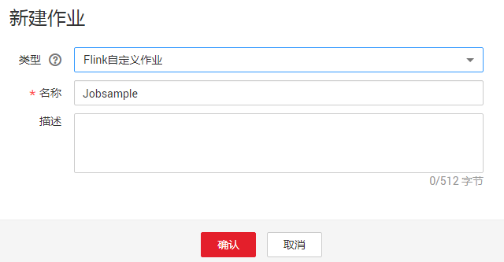

# 创建Flink自定义作业

本章节介绍如何新建Flink自定义作业。用户可以基于Flink的API进行二次开发，构建自己的应用Jar包并提交到DLI的队列运行，DLI完全兼容开源社区接口。此功能需要用户自己编写并构建应用Jar包，适合对Flink二次开发有一定了解，并对流计算处理复杂度要求较高的用户。

## 前提条件

-   用户运行Flink自定义作业时，需要将二次开发的应用代码构建为Jar包，上传到已经创建的OBS桶中。
-   由于DLI服务端已经内置了Flink的依赖包，并且基于开源社区版本做了安全加固。用户需要在构建应用Jar包时，将Flink的相关依赖排除，在Maven或者Sbt构建工具中可以通过将scope设为provided来实现。
-   确保已创建独享队列。

## 操作步骤

1.  在DLI管理控制台的左侧导航栏中，单击“作业管理“\>“Flink作业“，进入“Flink作业“页面。
2.  在“Flink作业“页面右上角单击“新建作业“，弹出“新建作业“对话框。

    **图 1**  新建Flink自定义作业  
    

3.  配置作业信息。

    **表 1**  作业配置信息

    
    <table><thead align="left"><tr id="row13672324503"><th class="cellrowborder" valign="top" width="14.48%" id="mcps1.2.3.1.1">
参数

    </th>
    <th class="cellrowborder" valign="top" width="85.52%" id="mcps1.2.3.1.2">
参数说明

    </th>
    </tr>
    </thead>
    <tbody><tr id="row206721244013"><td class="cellrowborder" valign="top" width="14.48%" headers="mcps1.2.3.1.1 ">
类型

    </td>
    <td class="cellrowborder" valign="top" width="85.52%" headers="mcps1.2.3.1.2 ">
Flink自定义作业。

    </td>
    </tr>
    <tr id="row96731524306"><td class="cellrowborder" valign="top" width="14.48%" headers="mcps1.2.3.1.1 ">
名称

    </td>
    <td class="cellrowborder" valign="top" width="85.52%" headers="mcps1.2.3.1.2 ">
作业名称，只能由英文、中文、数字、中划线和下划线组成，并且长度为1～57字节。

    
 说明： 

作业名称必须是唯一的。

    

    </td>
    </tr>
    <tr id="row9673142411010"><td class="cellrowborder" valign="top" width="14.48%" headers="mcps1.2.3.1.1 ">
描述

    </td>
    <td class="cellrowborder" valign="top" width="85.52%" headers="mcps1.2.3.1.2 ">
作业的相关描述，且长度为0～512字节。

    </td>
    </tr>
    </tbody>
    </table>

4.  单击“确认“，进入“编辑“页面。
5.  上传Jar包。

    **图 2**  上传Jar包  
    

    **表 2**  参数说明

    
    <table><thead align="left"><tr id="row93797534586"><th class="cellrowborder" valign="top" width="18.67%" id="mcps1.2.3.1.1">
名称

    </th>
    <th class="cellrowborder" valign="top" width="81.33%" id="mcps1.2.3.1.2">
描述

    </th>
    </tr>
    </thead>
    <tbody><tr id="row15461316185210"><td class="cellrowborder" valign="top" width="18.67%" headers="mcps1.2.3.1.1 ">
应用程序

    </td>
    <td class="cellrowborder" valign="top" width="81.33%" headers="mcps1.2.3.1.2 ">
用户自定义的程序包。在选择程序包之前需要将对应的jar包上传至OBS桶中，并在“数据管理&gt;程序包管理”中创建程序包，具体操作请参考<a href="创建程序包.md">创建程序包</a>。

    </td>
    </tr>
    <tr id="row192231446165220"><td class="cellrowborder" valign="top" width="18.67%" headers="mcps1.2.3.1.1 ">
Main Class

    </td>
    <td class="cellrowborder" valign="top" width="81.33%" headers="mcps1.2.3.1.2 ">
指定加载的Jar包类名，如KafkaMessageStreaming。

    <ul id="ul5801313537"><li>默认：根据Jar包文件的Manifest文件指定。</li><li>指定：需要输入类名并确定类参数列表（参数间用空格分隔）。</li></ul>
    
 说明： 

当类属于某个包时，需携带包路径，例如：packagePath.KafkaMessageStreaming。

    

    </td>
    </tr>
    <tr id="row15380135310587"><td class="cellrowborder" valign="top" width="18.67%" headers="mcps1.2.3.1.1 ">
参数

    </td>
    <td class="cellrowborder" valign="top" width="81.33%" headers="mcps1.2.3.1.2 ">
指定类的参数列表，参数之间使用空格分隔。

    </td>
    </tr>
    <tr id="row12301623195314"><td class="cellrowborder" valign="top" width="18.67%" headers="mcps1.2.3.1.1 ">
依赖jar包

    </td>
    <td class="cellrowborder" valign="top" width="81.33%" headers="mcps1.2.3.1.2 ">
用户自定义的依赖程序包。在选择程序包之前需要将对应的jar包上传至OBS桶中，并在“数据管理&gt;程序包管理”中创建程序包，具体操作请参考<a href="创建程序包.md">创建程序包</a>。

    </td>
    </tr>
    </tbody>
    </table>

6.  配置作业参数。

    **图 3**  配置参数  
    

    **表 3**  参数说明

    
    <table><thead align="left"><tr id="row145620521843"><th class="cellrowborder" valign="top" width="16.24%" id="mcps1.2.3.1.1">
名称

    </th>
    <th class="cellrowborder" valign="top" width="83.76%" id="mcps1.2.3.1.2">
描述

    </th>
    </tr>
    </thead>
    <tbody><tr id="row359118526411"><td class="cellrowborder" valign="top" width="16.24%" headers="mcps1.2.3.1.1 ">
CUs

    </td>
    <td class="cellrowborder" valign="top" width="83.76%" headers="mcps1.2.3.1.2 ">
一个CU为1核4G的资源量。CU数范围为2~400个。

    </td>
    </tr>
    <tr id="row14595175219417"><td class="cellrowborder" valign="top" width="16.24%" headers="mcps1.2.3.1.1 ">
管理单元

    </td>
    <td class="cellrowborder" valign="top" width="83.76%" headers="mcps1.2.3.1.2 ">
设置管理单元的CU数，支持设置1~4个CU数，默认值为1个CU。

    </td>
    </tr>
    <tr id="row959914521147"><td class="cellrowborder" valign="top" width="16.24%" headers="mcps1.2.3.1.1 ">
并行数

    </td>
    <td class="cellrowborder" valign="top" width="83.76%" headers="mcps1.2.3.1.2 ">
作业中每个算子的并行数。

    
 说明： 
<ul id="ul1660513521547"><li>并行数不能大于计算单元（CU-管理单元CU个数）的4倍。</li><li>并行数最好大于用户作业里设置的并发数，否则有可能提交失败。</li></ul>
    

    </td>
    </tr>
    <tr id="row1760615210415"><td class="cellrowborder" valign="top" width="16.24%" headers="mcps1.2.3.1.1 ">
保存作业日志

    </td>
    <td class="cellrowborder" valign="top" width="83.76%" headers="mcps1.2.3.1.2 ">
设置是否开启保存作业日志功能。

    
如果开启该功能，必须要选择OBS桶，且OBS桶必须授权才能使用。如果选择的OBS桶是未授权状态，需要单击“OBS授权”。

    
 说明： 

OBS服务的相关操作，请参见<a href="https://support.huaweicloud.com/obs/index.html" target="_blank" rel="noopener noreferrer">《对象存储服务控制台指南》</a>中的“入门”章节。

    

    </td>
    </tr>
    <tr id="row13189114720391"><td class="cellrowborder" valign="top" width="16.24%" headers="mcps1.2.3.1.1 ">
作业异常告警

    </td>
    <td class="cellrowborder" valign="top" width="83.76%" headers="mcps1.2.3.1.2 ">
设置是否将作业异常告警信息，如作业出现运行异常或者欠费情况，以SMN的方式通知用户。

    </td>
    </tr>
    <tr id="row51981436589"><td class="cellrowborder" valign="top" width="16.24%" headers="mcps1.2.3.1.1 ">
异常自动重启

    </td>
    <td class="cellrowborder" valign="top" width="83.76%" headers="mcps1.2.3.1.2 ">
设置是否启动异常自动重启功能，当作业异常时将自动重启并恢复作业。

    </td>
    </tr>
    </tbody>
    </table>

7.  选择作业所属队列。

    **图 4**  选择运行队列  
    

    > **说明：**   
    >-   自定义作业只能运行在预先创建的独享队列上。  
    >-   如果“作业所属队列“下拉框中无可用的独享队列，请先创建一个独享队列并将该队列绑定到当前用户。  

8.  单击右上角“提交“，进入“作业配置清单“页面，单击“确认“，将作业提交并启动。

    提交作业后，系统将自动跳转到“作业管理“页面，新创建的作业将显示在作业列表中，在“状态“列中可以查看作业状态。作业提交成功后，状态将由“提交中“变为“运行中“。运行完成后显示“已完成”。

    如果作业状态为“提交失败“或“运行异常“，表示作业提交或运行失败。用户可以在作业列表中的“状态“列中，将鼠标移动到状态图标上查看错误信息，单击可以复制错误信息。根据错误信息解决故障后，重新提交。

