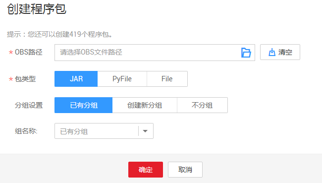

# 创建程序包

## 操作场景

DLI支持用户通过批处理方式将程序包提交至spark队列中运行。

## 操作步骤

1.  创建包的操作入口有两个，分别在“程序包管理“页面和“作业编辑器“页面。
    -   在“程序包管理“页面创建程序包。
        1.  在DLI管理控制台的顶部菜单栏中，选择“程序包管理“。
        2.  在“程序包管理“页面，单击可创建程序包。

    -   在“作业编辑器“页面创建程序包。
        1.  在DLI管理控制台的顶部菜单栏中，选择“作业编辑器“。
        2.  在左侧导航栏的页签，单击“程序包”右侧的可创建程序包。

2.  在“创建程序包“对话框，参见[表1](#zh-cn_topic_0122016946_zh-cn_topic_0093946917_table19616613171536)设置相关参数。

    **图 1**  创建程序包  
    

    **表 1**  参数说明

    
    <table><thead align="left"><tr id="zh-cn_topic_0122016946_zh-cn_topic_0093946917_row15177266171536"><th class="cellrowborder" valign="top" width="13.139999999999999%" id="mcps1.2.3.1.1">
参数名称

    </th>
    <th class="cellrowborder" valign="top" width="86.86%" id="mcps1.2.3.1.2">
描述

    </th>
    </tr>
    </thead>
    <tbody><tr id="zh-cn_topic_0122016946_zh-cn_topic_0093946917_row56284350171536"><td class="cellrowborder" valign="top" width="13.139999999999999%" headers="mcps1.2.3.1.1 ">
OBS路径

    </td>
    <td class="cellrowborder" valign="top" width="86.86%" headers="mcps1.2.3.1.2 ">
程序包需先上传至OBS服务中保存，在此处选择对应的OBS路径。单击，可创建多个程序包。

    </td>
    </tr>
    <tr id="zh-cn_topic_0122016946_zh-cn_topic_0093946917_row6112092132926"><td class="cellrowborder" valign="top" width="13.139999999999999%" headers="mcps1.2.3.1.1 ">
包类型

    </td>
    <td class="cellrowborder" valign="top" width="86.86%" headers="mcps1.2.3.1.2 ">
支持的包类型如下：

    <ul id="zh-cn_topic_0122016946_ul19355124635412"><li>JAR</li><li>PyFile</li><li>File</li></ul>
    </td>
    </tr>
    <tr id="row415617241883"><td class="cellrowborder" valign="top" width="13.139999999999999%" headers="mcps1.2.3.1.1 ">
分组设置

    </td>
    <td class="cellrowborder" valign="top" width="86.86%" headers="mcps1.2.3.1.2 ">
可选择“已有分组”，“创建新分组”或“不分组”。

    </td>
    </tr>
    <tr id="row740151051019"><td class="cellrowborder" valign="top" width="13.139999999999999%" headers="mcps1.2.3.1.1 ">
组名称

    </td>
    <td class="cellrowborder" valign="top" width="86.86%" headers="mcps1.2.3.1.2 "><ul id="ul17658122119107"><li>选择“已有分组”：可选择已有的分组。</li><li>选择“创建新分组”：可输入自定义的组名称。</li><li>选择“不分组”：不需要选择或输入组名称。</li></ul>
    </td>
    </tr>
    </tbody>
    </table>

3.  单击“确定“，完成创建程序包。

    程序包创建成功后，您可以在“程序包管理“页面或者“作业编辑器”页面查看和选择使用对应的包。

