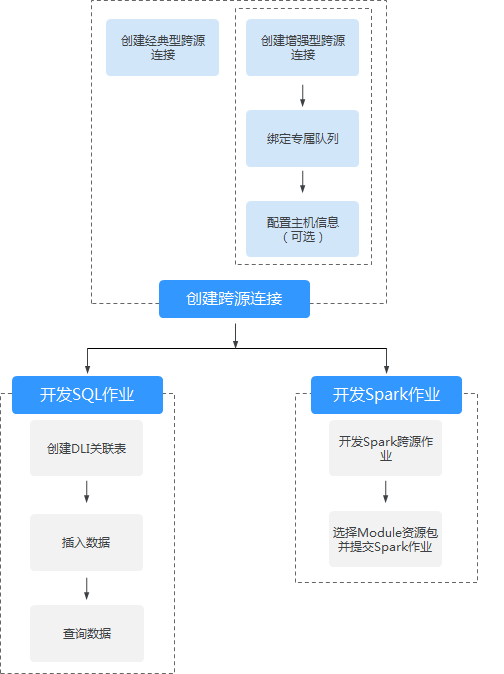

# 概述

## 操作场景

DLI支持原生Spark的DataSource能力，并在其基础上进行了扩展，能够通过SQL语句或者Spark作业访问其他数据存储服务并导入、查询、分析处理其中的数据。

DLI增强型跨源连接底层采用对等连接，直接打通DLI集群与目的数据源的vpc网络，通过点对点的方式实现数据互通，能够提供比经典型跨源更加灵活的使用场景与更加强劲的性能。增强型跨源支持所有DLI服务已实现的跨源业务，并且通过UDF、Spark作业等方式能够实现与自建/线下数据源之间的访问。增强型跨源仅支持包周期队列。

**表 1**  DLI支持的云服务数据源

<table><thead align="left"><tr id="row167251612123519"><th class="cellrowborder" valign="top" width="33.29332933293329%" id="mcps1.2.4.1.1">
服务名称

</th>
<th class="cellrowborder" valign="top" width="33.373337333733375%" id="mcps1.2.4.1.2">
经典型跨源连接

</th>
<th class="cellrowborder" valign="top" width="33.33333333333333%" id="mcps1.2.4.1.3">
增强型跨源连接

</th>
</tr>
</thead>
<tbody><tr id="row9725121218351"><td class="cellrowborder" valign="top" width="33.29332933293329%" headers="mcps1.2.4.1.1 ">
CloudTable HBase

</td>
<td class="cellrowborder" valign="top" width="33.373337333733375%" headers="mcps1.2.4.1.2 ">
√

</td>
<td class="cellrowborder" valign="top" width="33.33333333333333%" headers="mcps1.2.4.1.3 ">
√

</td>
</tr>
<tr id="row207251112173511"><td class="cellrowborder" valign="top" width="33.29332933293329%" headers="mcps1.2.4.1.1 ">
CloudTable OpenTSDB

</td>
<td class="cellrowborder" valign="top" width="33.373337333733375%" headers="mcps1.2.4.1.2 ">
√

</td>
<td class="cellrowborder" valign="top" width="33.33333333333333%" headers="mcps1.2.4.1.3 ">
√

</td>
</tr>
<tr id="row1372511253512"><td class="cellrowborder" valign="top" width="33.29332933293329%" headers="mcps1.2.4.1.1 ">
DWS

</td>
<td class="cellrowborder" valign="top" width="33.373337333733375%" headers="mcps1.2.4.1.2 ">
√

</td>
<td class="cellrowborder" valign="top" width="33.33333333333333%" headers="mcps1.2.4.1.3 ">
√

</td>
</tr>
<tr id="row0726191213517"><td class="cellrowborder" valign="top" width="33.29332933293329%" headers="mcps1.2.4.1.1 ">
RDS MySQL

</td>
<td class="cellrowborder" valign="top" width="33.373337333733375%" headers="mcps1.2.4.1.2 ">
√

</td>
<td class="cellrowborder" valign="top" width="33.33333333333333%" headers="mcps1.2.4.1.3 ">
√

</td>
</tr>
<tr id="row2726141283513"><td class="cellrowborder" valign="top" width="33.29332933293329%" headers="mcps1.2.4.1.1 ">
RDS PostGre

</td>
<td class="cellrowborder" valign="top" width="33.373337333733375%" headers="mcps1.2.4.1.2 ">
√

</td>
<td class="cellrowborder" valign="top" width="33.33333333333333%" headers="mcps1.2.4.1.3 ">
√

</td>
</tr>
<tr id="row272614129356"><td class="cellrowborder" valign="top" width="33.29332933293329%" headers="mcps1.2.4.1.1 ">
CSS

</td>
<td class="cellrowborder" valign="top" width="33.373337333733375%" headers="mcps1.2.4.1.2 ">
√

</td>
<td class="cellrowborder" valign="top" width="33.33333333333333%" headers="mcps1.2.4.1.3 ">
√

</td>
</tr>
<tr id="row11355916103715"><td class="cellrowborder" valign="top" width="33.29332933293329%" headers="mcps1.2.4.1.1 ">
MRS HBase

</td>
<td class="cellrowborder" valign="top" width="33.373337333733375%" headers="mcps1.2.4.1.2 ">
x

</td>
<td class="cellrowborder" valign="top" width="33.33333333333333%" headers="mcps1.2.4.1.3 ">
√

</td>
</tr>
<tr id="row1935619169378"><td class="cellrowborder" valign="top" width="33.29332933293329%" headers="mcps1.2.4.1.1 ">
MRS OpenTSDB

</td>
<td class="cellrowborder" valign="top" width="33.373337333733375%" headers="mcps1.2.4.1.2 ">
√

</td>
<td class="cellrowborder" valign="top" width="33.33333333333333%" headers="mcps1.2.4.1.3 ">
√

</td>
</tr>
<tr id="row103572166371"><td class="cellrowborder" valign="top" width="33.29332933293329%" headers="mcps1.2.4.1.1 ">
DCS Redis

</td>
<td class="cellrowborder" valign="top" width="33.373337333733375%" headers="mcps1.2.4.1.2 ">
x

</td>
<td class="cellrowborder" valign="top" width="33.33333333333333%" headers="mcps1.2.4.1.3 ">
√

</td>
</tr>
<tr id="row06857016383"><td class="cellrowborder" valign="top" width="33.29332933293329%" headers="mcps1.2.4.1.1 ">
DDS Mongo

</td>
<td class="cellrowborder" valign="top" width="33.373337333733375%" headers="mcps1.2.4.1.2 ">
x

</td>
<td class="cellrowborder" valign="top" width="33.33333333333333%" headers="mcps1.2.4.1.3 ">
√

</td>
</tr>
</tbody>
</table>

## 使用限制

-   系统default队列不支持创建跨源连接
-   访问跨源表需要使用已经创建跨源连接的队列
-   跨源表不支持Preview预览功能

## 操作流程

DLI跨源分析的基本流程如下：

**图 1**  跨源分析流程  

> **说明：**   
>增强型跨源连接需要绑定专属队列和配置主机信息。  

## 参考

-   管理控制台操作请参考[经典型跨源连接](经典型跨源连接.md)和[增强型跨源连接](增强型跨源连接.md)。
-   API接口请参考[《经典型跨源连接相关API》](https://support.huaweicloud.com/api-dli/dli_02_0144.html)和[《增强型跨源连接相关API》](https://support.huaweicloud.com/api-dli/dli_02_0187.html)。

-   访问对应的数据源。
    -   SQL作业请参考《数据湖探索SQL语法参考》\>[《HBase表》](https://support.huaweicloud.com/sqlreference-dli/dli_08_0119.html)、[《OpenTSDB表》](https://support.huaweicloud.com/sqlreference-dli/dli_08_0122.html)、[《DWS表》](https://support.huaweicloud.com/sqlreference-dli/dli_08_0193.html)、[《RDS表》](https://support.huaweicloud.com/sqlreference-dli/dli_08_0197.html)、[《CSS表》](https://support.huaweicloud.com/sqlreference-dli/dli_08_0201.html)、[《DCS表》](https://support.huaweicloud.com/sqlreference-dli/dli_08_0226.html)和[《DDS表》](https://support.huaweicloud.com/sqlreference-dli/dli_08_0230.html)。
    -   Spark作业请参考《数据湖探索开发指南》\>[《使用Spark作业开发DLI跨源连接》](https://support.huaweicloud.com/devg-dli/dli_09_0020.html)。

