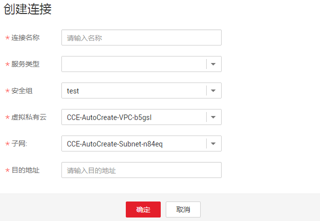
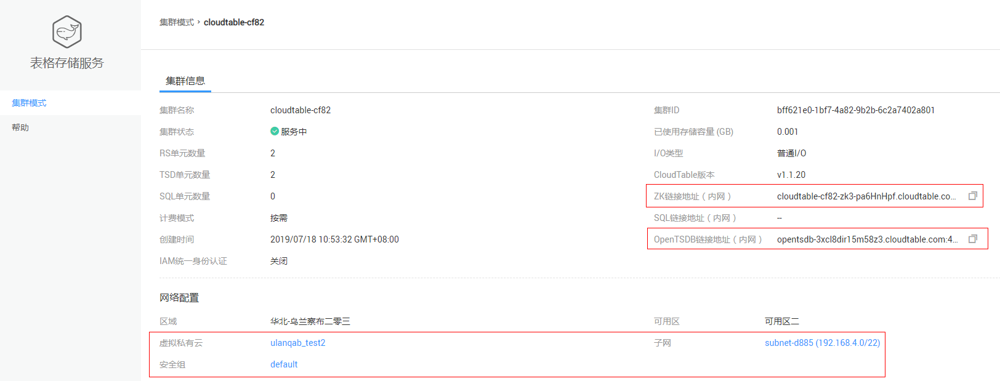
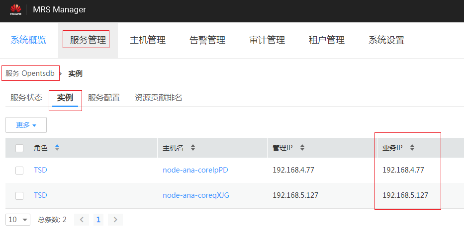
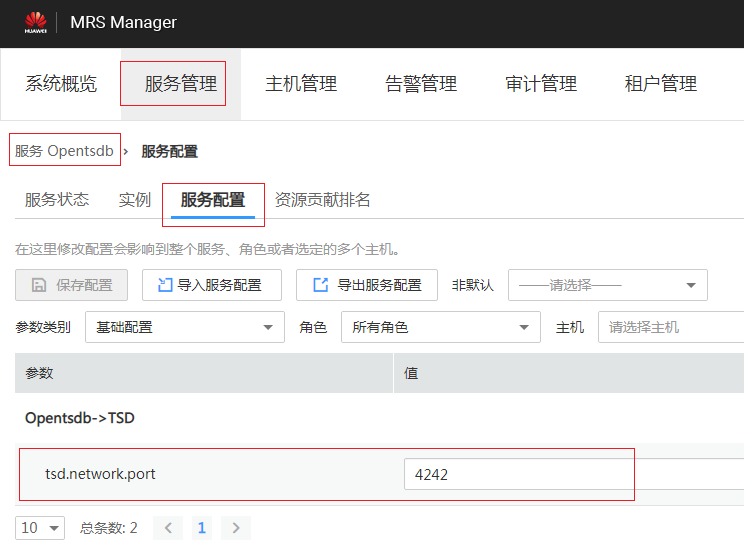
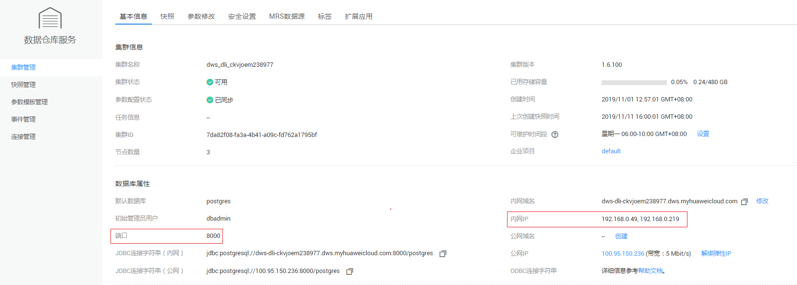
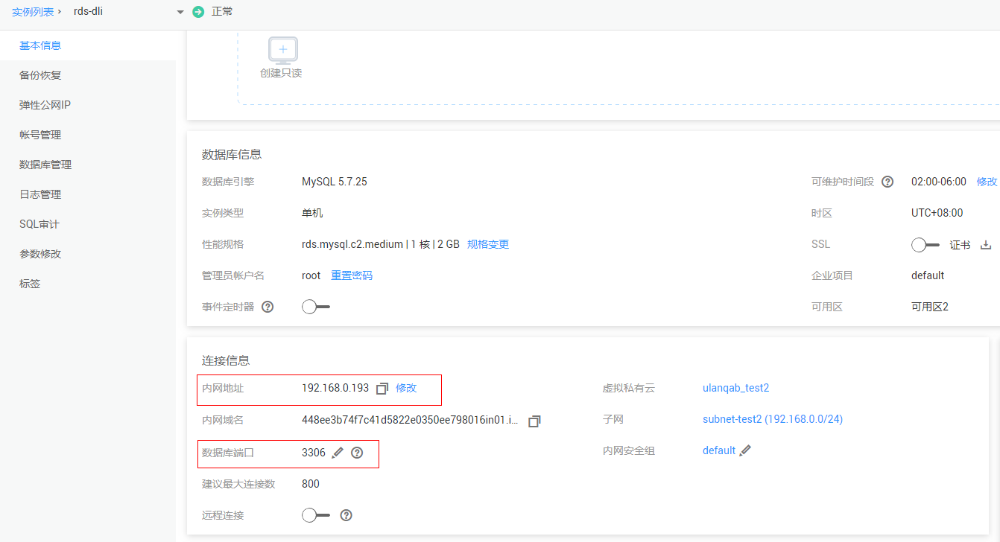

# 经典型跨源连接

## 操作场景

DLI 经典型跨源连接可用于访问CloudTable的Hbase和OpenTSDB，MRS的OpenTSDB，DWS，RDS，CSS数据源。开发SQL作业请参考《数据湖探索SQL语法参考》\>[HBase表](https://support.huaweicloud.com/sqlreference-dli/dli_08_0119.html)，[OpenTSDB表](https://support.huaweicloud.com/sqlreference-dli/dli_08_0122.html)，[DWS表](https://support.huaweicloud.com/sqlreference-dli/dli_08_0193.html)，[RDS表](https://support.huaweicloud.com/sqlreference-dli/dli_08_0197.html)和[CSS表](https://support.huaweicloud.com/sqlreference-dli/dli_08_0201.html)。开发Spark作业请参考《数据湖探索开发指南》\>[《使用DLI跨源能力》](https://support.huaweicloud.com/devg-dli/dli_09_0020.html)。

> **说明：**   
>经典型跨源只适用于用户自建queue，不适用于系统default队列。  

经典型跨源主要包括如下功能：

-   [创建连接](#section73391334165211)
-   [查找连接](#section9644161019415)
-   [查看连接详情](#section1960402414173)
-   [删除连接](#section8647175812179)

## 经典型跨源页面

显示所有的经典型跨源连接，连接数量较多时，系统分页显示。

**表 1**  跨源连接列表参数

<table><thead align="left"><tr id="row2555468715120"><th class="cellrowborder" valign="top" width="21.18%" id="mcps1.2.3.1.1">
参数

</th>
<th class="cellrowborder" valign="top" width="78.82000000000001%" id="mcps1.2.3.1.2">
参数说明

</th>
</tr>
</thead>
<tbody><tr id="row46758327132"><td class="cellrowborder" valign="top" width="21.18%" headers="mcps1.2.3.1.1 ">
连接名称

</td>
<td class="cellrowborder" valign="top" width="78.82000000000001%" headers="mcps1.2.3.1.2 ">
所创建的跨源连接名称。

</td>
</tr>
<tr id="row32873162171713"><td class="cellrowborder" valign="top" width="21.18%" headers="mcps1.2.3.1.1 ">
连接状态

</td>
<td class="cellrowborder" valign="top" width="78.82000000000001%" headers="mcps1.2.3.1.2 ">
跨源连接的状态信息，包括如下状态：

<ul id="ul32930526154023"><li>创建中</li><li>已激活</li><li>已失败</li><li>连接异常</li><li>已失效</li></ul>
</td>
</tr>
<tr id="row31011923151038"><td class="cellrowborder" valign="top" width="21.18%" headers="mcps1.2.3.1.1 ">
服务类型

</td>
<td class="cellrowborder" valign="top" width="78.82000000000001%" headers="mcps1.2.3.1.2 ">
目前支持访问的数据源类型如下：

<ul id="ul127459715563"><li>表格存储服务 CloudTable HBase和CloudTable OPENTSDB</li><li>MapReduce服务 MRS OPENTSDB</li><li>数据仓库服务 DWS</li><li>云数据库（关系型数据库） RDS</li><li>云搜索服务 CSS</li></ul>
</td>
</tr>
<tr id="row36301606171658"><td class="cellrowborder" valign="top" width="21.18%" headers="mcps1.2.3.1.1 ">
连接地址

</td>
<td class="cellrowborder" valign="top" width="78.82000000000001%" headers="mcps1.2.3.1.2 ">
跨源连接创建成功后将显示连接地址，用于在SQL或Spark作业中访问其他数据源。

</td>
</tr>
<tr id="row6424839516213"><td class="cellrowborder" valign="top" width="21.18%" headers="mcps1.2.3.1.1 ">
目的地址

</td>
<td class="cellrowborder" valign="top" width="78.82000000000001%" headers="mcps1.2.3.1.2 ">
目的数据源的原始地址。

</td>
</tr>
<tr id="row2449114254419"><td class="cellrowborder" valign="top" width="21.18%" headers="mcps1.2.3.1.1 ">
创建时间

</td>
<td class="cellrowborder" valign="top" width="78.82000000000001%" headers="mcps1.2.3.1.2 ">
每个连接的创建时间，可按创建时间顺序或倒序显示连接列表。

</td>
</tr>
<tr id="row1883611569448"><td class="cellrowborder" valign="top" width="21.18%" headers="mcps1.2.3.1.1 ">
进度

</td>
<td class="cellrowborder" valign="top" width="78.82000000000001%" headers="mcps1.2.3.1.2 ">
连接创建的进度， 用百分比表示。

</td>
</tr>
<tr id="row1662880815250"><td class="cellrowborder" valign="top" width="21.18%" headers="mcps1.2.3.1.1 ">
操作

</td>
<td class="cellrowborder" valign="top" width="78.82000000000001%" headers="mcps1.2.3.1.2 "><ul id="ul119481446154811"><li>删除：当连接状态在“创建中”时，连接不可删除。</li><li>重新激活：当连接状态在“创建中”和“已失败”时，连接不可重新激活。</li></ul>
</td>
</tr>
</tbody>
</table>

## 创建连接

1.  创建需要访问的数据源。例如，需要访问CloudTable数据源，请先在CloudTable服务中购买集群。

    **图 1**  CloudTable购买集群  
    

    如果已有可用集群，可不用重新购买。

2.  在SQL作业/Spark作业的顶部菜单栏中，选择“跨源连接“。
3.  选择“经典型跨源“页签，单击左上角的“创建”按钮。

    输入连接名称，选择服务类型，安全组，虚拟私有云，子网，输入目的地址，详细参数介绍请参见[表2](#table24931148155220)。

    **图 2**  创建经典型跨源连接  
    

    **表 2**  参数说明

    
    <table><thead align="left"><tr id="row1149712486527"><th class="cellrowborder" valign="top" width="13.29%" id="mcps1.2.3.1.1">
参数

    </th>
    <th class="cellrowborder" valign="top" width="86.71%" id="mcps1.2.3.1.2">
参数说明

    </th>
    </tr>
    </thead>
    <tbody><tr id="row1350324845215"><td class="cellrowborder" valign="top" width="13.29%" headers="mcps1.2.3.1.1 ">
连接名称

    </td>
    <td class="cellrowborder" valign="top" width="86.71%" headers="mcps1.2.3.1.2 ">
所创建的跨源连接名称。

    <ul id="ul185072486523"><li>名称只能包含数字、英文字母、下划线和中划线。不能为空。</li><li>输入长度不能超过64个字符。</li></ul>
    </td>
    </tr>
    <tr id="row105181748125210"><td class="cellrowborder" valign="top" width="13.29%" headers="mcps1.2.3.1.1 ">
服务类型

    </td>
    <td class="cellrowborder" valign="top" width="86.71%" headers="mcps1.2.3.1.2 ">
目前支持访问六种类型数据源。

    <ul id="ul25191248185210"><li>表格存储服务 CloudTable和CloudTable.OPENTSDB</li><li>MapReduce服务 MRS.OPENTSDB</li><li>数据仓库服务 DWS</li><li>云数据库（关系型数据库） RDS</li><li>云搜索服务 CSS</li></ul>
    </td>
    </tr>
    <tr id="row85241748185212"><td class="cellrowborder" valign="top" width="13.29%" headers="mcps1.2.3.1.1 ">
安全组

    </td>
    <td class="cellrowborder" valign="top" width="86.71%" headers="mcps1.2.3.1.2 ">
选择对应的安全组信息。不同服务的安全组信息，可在创建对应的服务集群或实例时由系统提供，或查看已有集群或数据库实例信息。请参考<a href="#fig146051236112718">图 CloudTable集群信息</a>。

    </td>
    </tr>
    <tr id="row7764655142317"><td class="cellrowborder" valign="top" width="13.29%" headers="mcps1.2.3.1.1 ">
虚拟私有云

    </td>
    <td class="cellrowborder" valign="top" width="86.71%" headers="mcps1.2.3.1.2 ">
选择对应的虚拟私有云信息。不同服务的虚拟私有云信息，可在创建对应的服务集群或实例时由系统提供，或查看已有集群或数据库实例信息。请参考<a href="#fig146051236112718">图 CloudTable集群信息</a>。

    </td>
    </tr>
    <tr id="row1095810374248"><td class="cellrowborder" valign="top" width="13.29%" headers="mcps1.2.3.1.1 ">
子网

    </td>
    <td class="cellrowborder" valign="top" width="86.71%" headers="mcps1.2.3.1.2 ">
选择对应的子网信息。不同服务的子网信息，可在创建对应的服务集群或实例时由系统提供，或查看已有集群或数据库实例信息。请参考<a href="#fig146051236112718">图 CloudTable集群信息</a>。

    </td>
    </tr>
    <tr id="row135261748155213"><td class="cellrowborder" valign="top" width="13.29%" headers="mcps1.2.3.1.1 ">
目的地址

    </td>
    <td class="cellrowborder" valign="top" width="86.71%" headers="mcps1.2.3.1.2 ">
连接目的数据源的地址。不同服务的地址略有不同。

    <ul id="ul9527124812520"><li>表格存储服务 CloudTable：ZK链接地址或者OpenTSDB链接地址，请参考<a href="#fig146051236112718">图 CloudTable集群信息</a>。</li><li>MapReduce服务 OpenTSDB：OpenTSDB所在节点的IP：OpenTSDB服务对外端口，请参考<a href="#fig786231315289">图 MRS集群OpenTSDB IP信息</a>和<a href="#fig168720405285">图 MRS集群OpenTSDB 端口信息</a>。
MRS OpenTSDB IP信息和端口信息获取方式：

    <ol id="ol203845913189"><li>在MRS集群列表中，单击所使用的集群名称，进入集群“概览”页；</li><li>在集群“基本信息”中找到“集群管理页面”，单击“点击查看”；</li><li>输入用户名和密码（“用户名”和“密码”为购买MRS集群时设置，“用户名”默认为“admin”），单击“登录”进入“MRS Manager”页面；</li><li>选择“服务管理”页签；</li><li>进入“Opentsdb”服务；</li><li>选择“实例”页签，可以查看对应业务IP，可选择任意一个业务IP。
选择“服务配置”页签，找到OpenTSDB的对外端口。

    </li></ol>
    
 说明： 

如果MapReduce服务集群存在多个IP，创建跨源连接时填写其中任意一个业务IP即可。

    

    </li><li>数据仓库服务 DWS：内网IP:端口，请参考<a href="#fig484965102916">图 DWS集群信息</a>。
 说明： 

DWS服务集群提供2个内网IP，创建跨源连接时填写其中任意一个内网IP即可。

    

    </li><li>云数据库（关系型数据库） RDS：内网地址:数据库端口，请参考<a href="#fig194016261294">图 RDS集群信息</a>。</li><li>云搜索服务 CSS：内网地址:端口，请参考<a href="#fig125068465296">图 CSS集群信息</a>。
 说明： 

如果CSS服务集群存在多个内网IP，创建跨源连接时填写其中任意一个内网IP即可。

    

    </li></ul>
    </td>
    </tr>
    </tbody>
    </table>

    **图 3**  CloudTable集群信息  
    

    **图 4**  MRS集群OpenTSDB IP信息  
    

    **图 5**  MRS集群OpenTSDB 端口信息  
    

    **图 6**  DWS集群信息  
    

    **图 7**  RDS集群信息  
    

    **图 8**  CSS集群信息  
    

4.  单击“确定“，完成连接创建。

## 查找连接

在“经典型跨源“页面，可在搜索框中输入连接名称关键字，查找与之匹配的连接。

## 查看连接详情

在“经典型跨源“页面，选中一条连接，单击该连接对应的，可查看该条连接的详细信息。

包括：连接名称，连接地址，服务类型，连接ID，目的地址，日志详情。

> **说明：**   
>当“连接状态“为“失败“，“日志详情“显示“失败原因“。  

## 删除连接

在“经典跨源“页面，可单击“操作”列的“删除“，删除不需要的连接。

> **说明：**   
>当“连接状态“为“创建中“时，连接不可删除。  

